# System Workflow Diagrams

## 1. Overall System Architecture

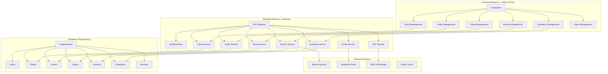

## 2. Client Onboarding Workflow

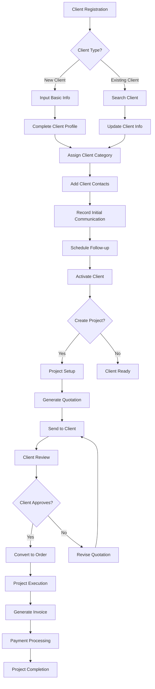

## 3. Order Management Workflow

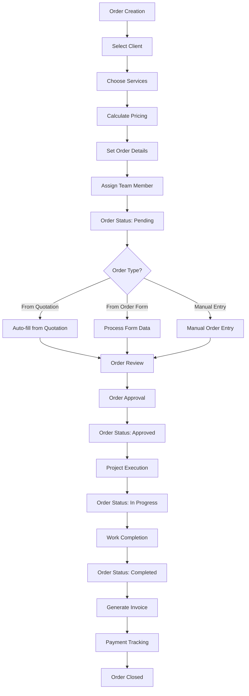

## 4. Quotation Generation Workflow

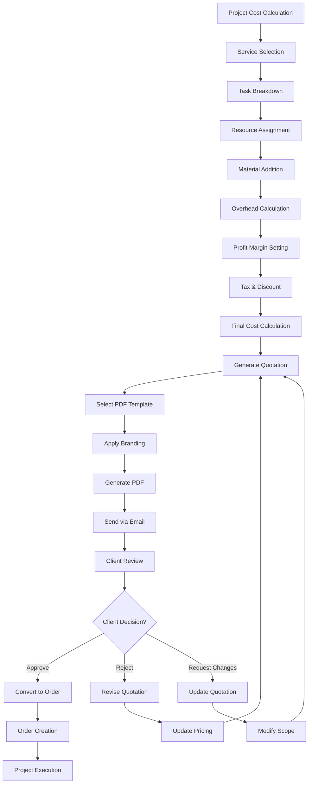

## 5. Ticket Management Workflow

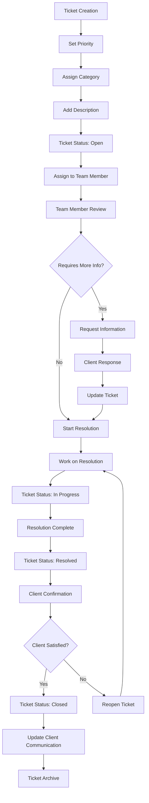

## 6. Invoice & Payment Workflow

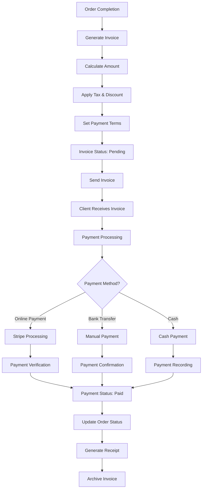

## 7. Email & PDF Generation Workflow

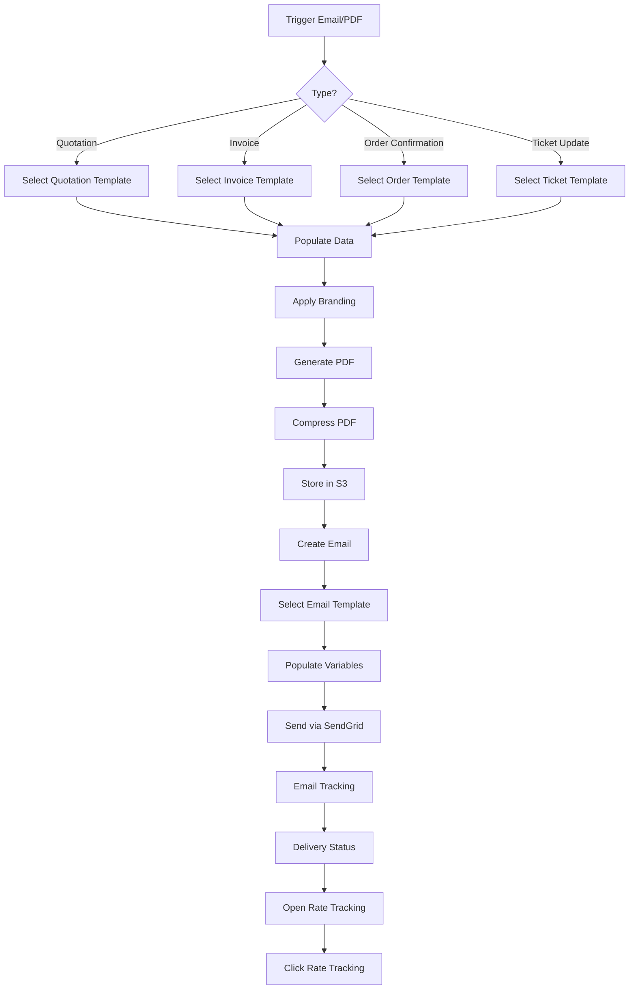

## 8. Multi-Tenant Data Flow

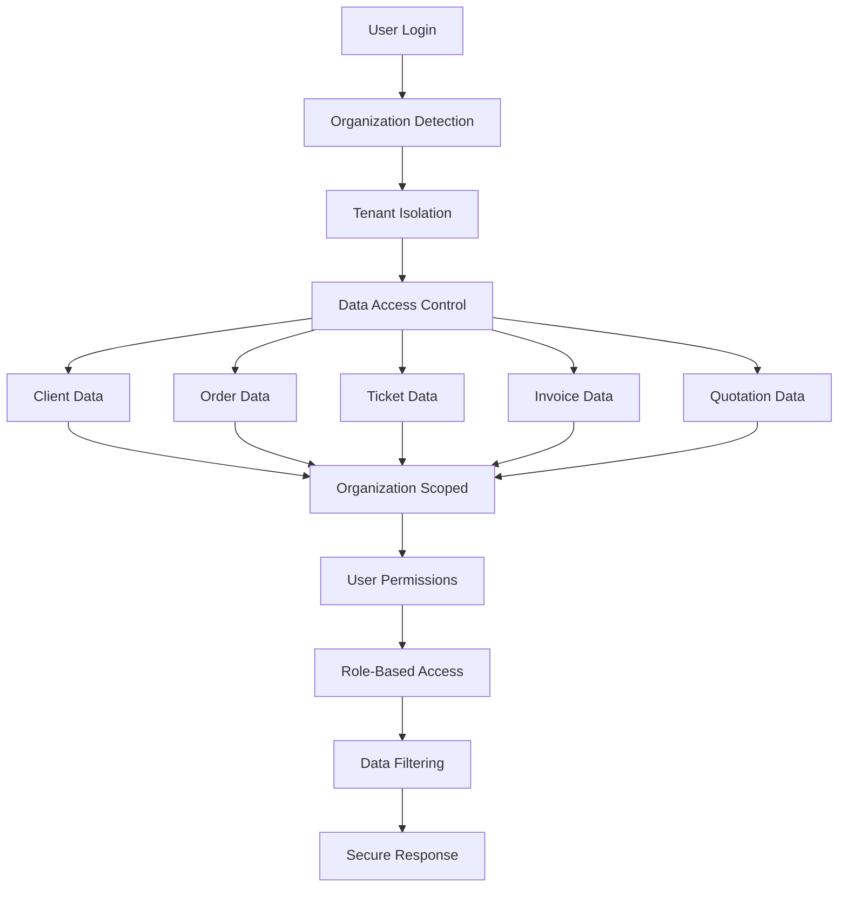

## 9. Subscription & Billing Workflow

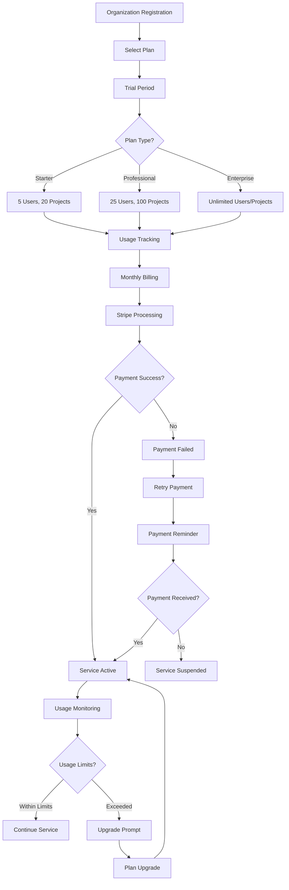

## 10. Cost Calculation Workflow

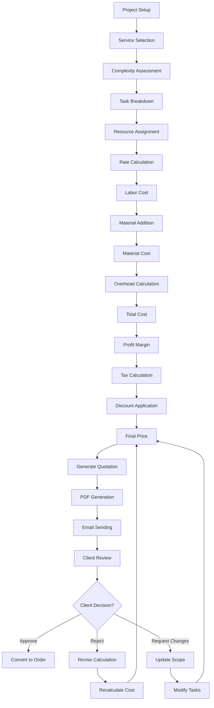

## 11. File Management Workflow

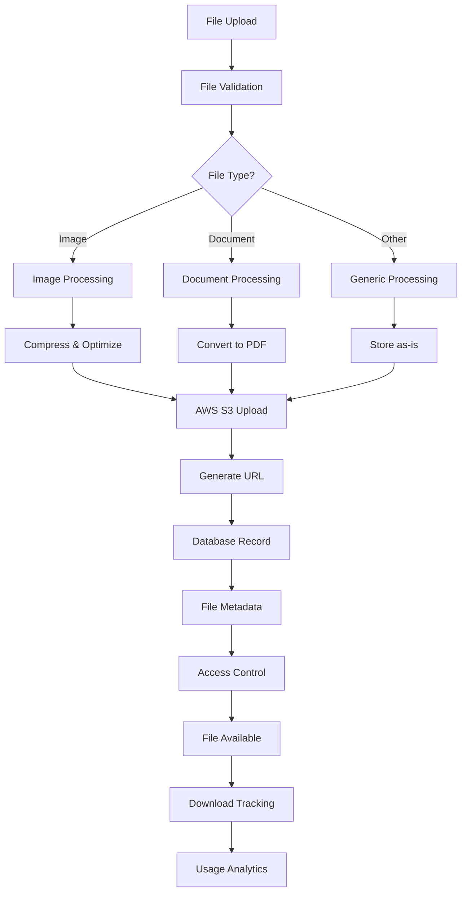

## 12. Analytics & Reporting Workflow

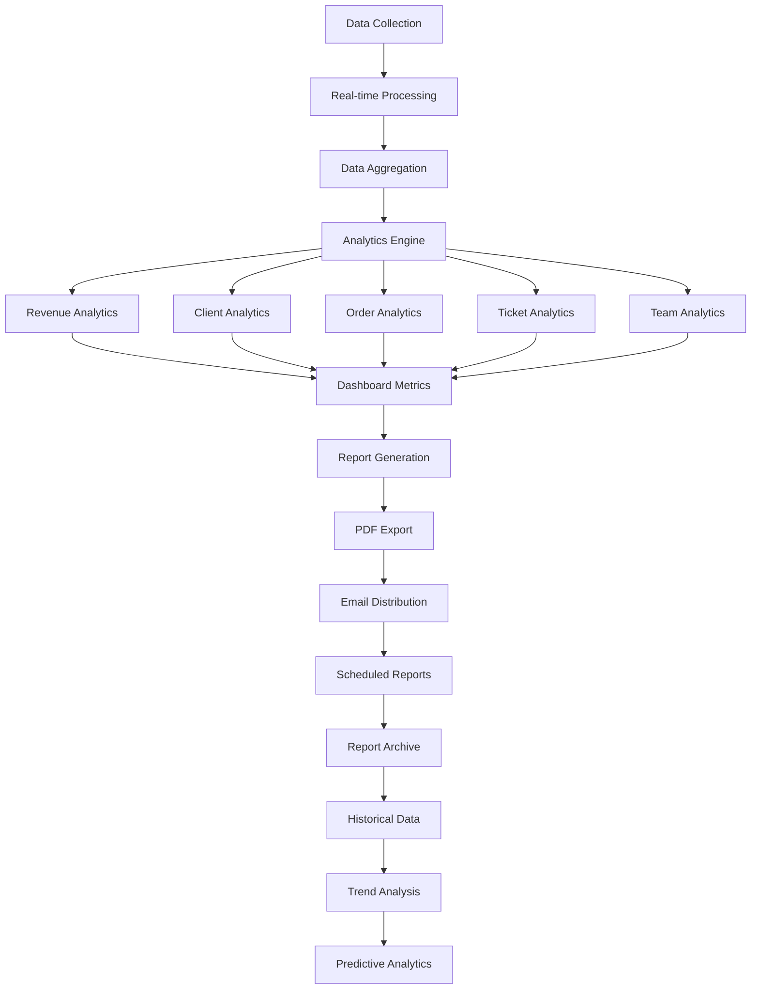

## 13. Security & Authentication Workflow

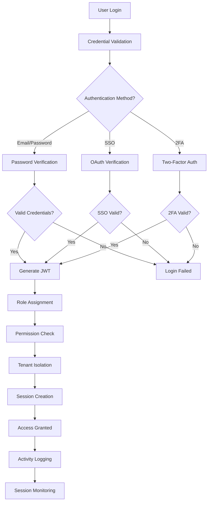

## 14. API Request Flow

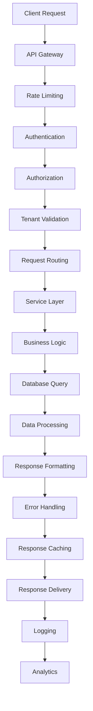

## 15. Error Handling Workflow

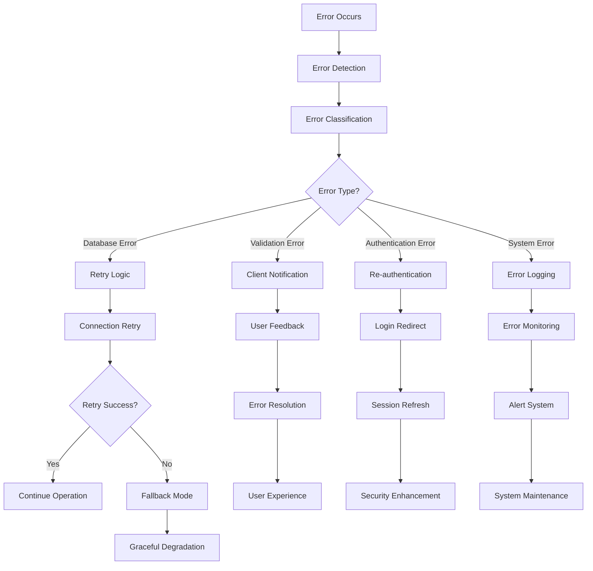

---

## Usage Instructions

### Untuk menggunakan diagram ini:

1. **Copy diagram code** dari section yang diinginkan
2. **Paste ke Mermaid Live Editor**: https://mermaid.live/
3. **Atau gunakan di Markdown** dengan syntax:
   ```markdown
   ```mermaid
   [diagram code]
   ```
   ``` 